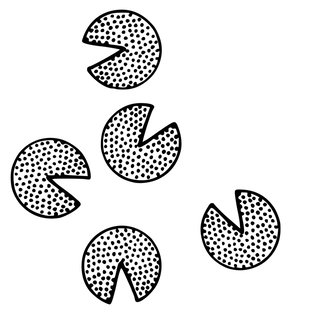

<!-- Output copied to clipboard! -->

<!-----

You have some errors, warnings, or alerts. If you are using reckless mode, turn it off to see inline alerts.
* ERRORs: 0
* WARNINGs: 0
* ALERTS: 5

Conversion time: 1.278 seconds.

Using this Markdown file:

1. Paste this output into your source file.
2. See the notes and action items below regarding this conversion run.
3. Check the rendered output (headings, lists, code blocks, tables) for proper
   formatting and use a linkchecker before you publish this page.

Conversion notes:

* Docs to Markdown version 1.0β33
* Thu Jun 09 2022 13:53:56 GMT-0700 (PDT)
* Source doc: ch02-14 ¶14 Development Team
* This document has images: check for >>>>>  gd2md-html alert:  inline image link in generated source and store images to your server. NOTE: Images in exported zip file from Google Docs may not appear in  the same order as they do in your doc. Please check the images!

----->

## ¶14 Development Team
¶14 開発チーム

Alias: Development/Delivery Team \
別名：開発/デリバリーチーム

Confidence stars: ** \
信頼度：**

<!-- ...coming out of [​¶2 The Mist​](https://learning.oreilly.com/library/view/a-scrum-book/9781680507577/f_0033.xhtml#sec.The.Mist), the [​¶11 Product Owner​](https://learning.oreilly.com/library/view/a-scrum-book/9781680507577/f_0042.xhtml#sec.Product.Owner) has a product [​¶39 Vision​](https://learning.oreilly.com/library/view/a-scrum-book/9781680507577/f_0074.xhtml#sec.Vision) whose realization is beyond the reach of any individual. The **_Product Owner_** is either working alone at the forefront of a new venture or working in the company of people who share passion for the same **_Vision_**. The fledgling effort might have formed in **_The Mist_** and needs to come together. The effort is at a point of taking steps to turn the **_Vision_** into a reality, both by coordinating the work of the longstanding members of the group and by potentially involving new people. Together, they seek a way to balance their collective identity with individual development responsibilities: to connect to each other under a framework that manages time and talent to support the business and create a rewarding workplace. \ -->
..._[¶2 The Mist​](https://learning.oreilly.com/library/view/a-scrum-book/9781680507577/f_0033.xhtml#sec.The.Mist)_より出て、[​¶11 Product Owner​](https://learning.oreilly.com/library/view/a-scrum-book/9781680507577/f_0042.xhtml#sec.Product.Owner)は、プロダクト¶39ビジョンを持っている。その実現が個人の手には余るようなものだ。**_プロダクトオーナー_**は、新しいベンチャー企業の最前線で一人で働いているか、企業の中で同じ**_ビジョン_**への情熱を共有する人々と一緒に働いている。走り始めるための活動は**_The Mist_**の中で形成されているかもしれず、一つにまとまる必要がある。その活動は、ビジョンを現実のものにするためのステップを踏む段階にある。長くいるメンバーの仕事を調整したり、新しい人々を巻き込むんこともあり、両方を行う。彼らはともに、集団としてのアイデンティティと個人の開発責任を両立させる方法を模索している。つまり、ビジネスを支えるために時間と能力を管理する枠組みのもとで互いに繋がり、働きがいのある職場を作ろうとしている。

<!-- **Many great endeavors cannot achieve excellence through individual effort alone; the greatest power in production comes from teamwork.** Great individuals can produce great products, but starting with a single individual makes it difficult to scale later. Each new person detracts from the effectiveness of everyone else on the team by about 25 percent for about 6 months (rule of thumb from James Coplien). Some products simply cannot realize greatness at the hands of a single individual, and without good feedback it is easy to get blindsided. Experience shows that person for person, teams outperform individuals: many hands make light work. While industry data show a range of 10 to 1 in _individual_ programmer to _teams_ output (_[Making Software [OW10]](https://learning.oreilly.com/library/view/a-scrum-book/9781680507577/f_0144.xhtml#d5924e5164)_, pp. 567--574), other data show that some teams outperformed others by a factor of 2000 to 1 (_[Scrum: The Art of Doing Twice the Work in Half the Time [SS14]](https://learning.oreilly.com/library/view/a-scrum-book/9781680507577/f_0144.xhtml#d5924e6627)_, p. 42). \ -->
**偉大な試みの多くは、個人の努力だけでは優れた業績に至ることができない。生産における最高の力は、チームワークから生まれる。**優れた個人は優れたプロダクトを生み出すことができるが、一人で始めた場合、後からスケールすることは難しくなる。一人増えるごとに、チームの他のメンバーの有効性が約25％、約6ヶ月の間損なわれる（James Coplienの経験則）。プロダクトの中には、個人一人で大きな成果を実現するには単純に手に余るようなものもある。適切なフィードバックがなければ、思ってもいなかったようなことになってしまう。経験上、人と人、チームは個人を上回る。人手が多ければ仕事は楽になる。業界のデータでは、プログラマー_個人_とチームのアウトプットは10対1の範囲にあることが示されていますが（Making Software [OW10]、567～574ページ）、他のデータでは、2000対1の割合で他を上回るチームもある（Scrum: The Art of Doing Twice the Work in Half the Time [SS14]、42ページ）。 \

<!-- On the other hand, it’s difficult to form a consensus direction across an overly large group—too many cooks spoil the broth. A development department composed of handfuls of people _can_ eventually achieve consensus, but usually can do so only with long mutual deliberation and socialization. Such delay is intolerable in a responsive business. \ -->
一方で、あまりにも大きなグループでは、方向性を一致させることは難しい。料理人が多すぎてスープを駄目にしてしまう。一握りの人数で構成される開発部門は、最終的にはコンセンサスに至る_はず_だが、それは互いの検討や社会化に長い時間をかけた場合のみであるのが普通だ。責任のあるビジネスを行う上で、このような遅れは許されるものではない。

<!-- In the lean startup model, everybody does everything, whether related to business, process, or production. The problem is that market shearing layers (different segments of the market whose needs evolve at different rates) and rates of change can be different than those of development. Market analysis and planning can play out over several months, while development for the market typically follows a monthly rhythm ([​¶77 Follow the Moon​](https://learning.oreilly.com/library/view/a-scrum-book/9781680507577/f_0116.xhtml#sec.Follow.the.Moon)) and can be as short as a day, or even hours or minutes for live customer emergencies. So putting both functions in one tightly coupled organizational unit puts stress on people and on schedules. Such a model is not sustainable as the enterprise grows. \ -->
リーン・スタートアップ・モデルでは、ビジネス、プロセス、生産に関連しているかどうかに関わらず、すべての人員がすべてを行う。問題は、市場は多層的（市場には異なるセグメントがあり、そのニーズは異なる速度で変化する）であり、変化の速度は開発のそれとは異なり得る、ということだ。市場分析と計画づくりが数ヶ月に渡って行われ、市場に向けた開発は典型的には月次のリズムに沿って行われる。そして顧客への緊急対応は最短で1日、あるいは数時間または数分で行われることもある。そのため、この両方の機能を単一の組織ユニットに持たせ密結合させると、人にもスケジュールにもストレスをかけることになる。企業の成長にとって、このようなモデルは持続可能なものではない。

<!-- Organizations need to run on multiple cadences. One cadence may be the day-to-day work of creating a product; another may be the longer cycles of working with the market. Role differentiation should primarily follow from variations in these cadences, according to the “Role Theory’’ chapter in _[The Handbook of Social Psychology [LA68]](https://learning.oreilly.com/library/view/a-scrum-book/9781680507577/f_0144.xhtml#d5924e3991)_ (pp. 488--567). History, experience, and inclination draws individuals to particular roles, which may lead to problems for organizations because roles may not work to the needed cadences. The organization needs to work coherently. \ -->
組織は複数のリズムで動く必要がある。リズムの1つは、プロダクトを作る日々の作業であり、もう1つは、市場と向き合う長いサイクルかもしれない。『_[The Handbook of Social Psychology](https://learning.oreilly.com/library/view/a-scrum-book/9781680507577/f_0144.xhtml#d5924e3991)_』[LA68]の「役割理論」の章（488～567ページ）によれば、役割の差異化は、これらのリズムの違いに主に従うべきだ。歴史、経験、傾向は個人を特定の役割に引き寄せるが、役割は必要なリズムで機能しないかもしれず、組織の問題につながる可能性がある。組織は整然と動く必要がある。

Therefore: \
そのため：

<!-- **Building on [​¶15 Stable Teams​](https://learning.oreilly.com/library/view/a-scrum-book/9781680507577/f_0046.xhtml#sec.Stable.Teams), create a _Development Team_ that rallies around a product inspired by the _Product Owner_’s _Vision_, to deliver successive increments of that product through the [​¶41 Value Stream​](https://learning.oreilly.com/library/view/a-scrum-book/9781680507577/f_0076.xhtml#sec.Value.Stream) to its end users.** The team is a bonding of approximately five collocated individuals (see[​¶8 Collocated Team​](https://learning.oreilly.com/library/view/a-scrum-book/9781680507577/f_0039.xhtml#sec.Collocated.Team) and [​¶9 Small Teams​](https://learning.oreilly.com/library/view/a-scrum-book/9781680507577/f_0040.xhtml#sec.Small.Teams)) committed to working with each other towards a common goal. \ -->
** [​¶15 Stable Teams​](https://learning.oreilly.com/library/view/a-scrum-book/9781680507577/f_0046.xhtml#sec.Stable.Teams)に基づき、プロダクトオーナーのビジョンに端を発したプロダクトに集う開発チームを作り、[​¶41 Value Stream](https://learning.oreilly.com/library/view/a-scrum-book/9781680507577/f_0076.xhtml#sec.Value.Stream)を通じてエンドユーザーにそのプロダクトのインクリメントを連続して提供する。**チームは、およそ５人の個人が隣り合わせに配置され団結しており（[​¶8 Collocated Team​](https://learning.oreilly.com/library/view/a-scrum-book/9781680507577/f_0039.xhtml#sec.Collocated.Team)と[​¶9 Small Teams​](https://learning.oreilly.com/library/view/a-scrum-book/9781680507577/f_0040.xhtml#sec.Small.Teams)を参照）、共通の目標に対しお互いに協力することにコミットしている。

<!-- The team is autonomous: self-selected, self-organizing, and self-managing. Give the individuals a collective identity to realize the **_Product Owner_**’s **_Vision_. **The **_Product Owner_** can tell them: “This is your product—do it.” \ -->
チームは自律的な（自分で選択し、自分で組織し、自分で管理する）ものだ。その個人個人に**_プロダクトオーナー_**の**_ビジョン_**を実現するという、集団としてのアイデンティティを与える。**_プロダクトオーナー_**は、彼らにこう言うことができる。「これはあなた達のプロダクトだ。やってくれ。」

<!-- The individuals forge a new identity tied to the product’s **_Vision_** while honoring each other’s identity within the new organizational unit. It’s not about scaling individual potential to raise productivity to some production level. It is about changing the paradigm of development to that of a collective mind, a Whole that can achieve more than the sum of the individuals. \ -->
新しい組織の中で個人は、お互いのアイデンティティを尊重しながら、プロダクトの**_ビジョン_**と繋がる新しいアイデンティティを形成する。それは、生産性をあるレベルまで高めるために個人のポテンシャルをスケールアップする、ということではない。それは、開発のパラダイムを、個人の総和以上のものを達成できる集合的な心としての、「全体」へと変えることだ。

<!-- You can build the team either top-down or bottom-up, but in either case you need a **_Vision_** to seed the team. In the top-down approach, the **_Product Owner_** hires the team after securing funding for the effort. The bottom-up approach arises from a setting like that of a lean startup: _We are a bunch of nerds and we struggle to respond to the market and we want to be identified as the development team. Who do we respond to? The Product Owner. How do we work? From the top of the [​¶54 Product Backlog​](https://learning.oreilly.com/library/view/a-scrum-book/9781680507577/f_0092.xhtml#sec.Product.Backlog). _The team can further evolve according to the Scrum framework with the introduction of other patterns, as described in the rest of this pattern. \ -->
チームは、トップダウンでもボトムアップでも作ることができるが、どちらの場合でもチームの種となるビジョンが必要となる。トップダウンのアプローチでは、**_プロダクトオーナー_**が労力のための資金を確保した上で、チームを採用する。ボトムアップのアプローチは、リーンスタートアップのような環境から生まる。「_私たちはオタクの集まりで、市場に対応するために奮闘しており、開発チームとして認められたいと考えている。私たちが応えるのは誰か？それはプロダクトオーナーだ。私たちはどのように仕事をするか？[​それは¶54 Product Backlog](https://learning.oreilly.com/library/view/a-scrum-book/9781680507577/f_0092.xhtml#sec.Product.Backlog)の先頭からだ。_」このパターンの残りの部分で説明するように、他のパターンを導入することで、スクラムのフレームワークに沿ってチームはさらに進化することができる。

<!-- If you don’t yet have a stable candidate team in place, then strongly consider building a **_[¶116 Self-Selecting Team](https://learning.oreilly.com/library/view/a-scrum-book/9781680507577/f_0141.xhtml#patlet-Self.Selecting.Team)_** from available personnel, from scratch, and/or from the market. Look for a community of trust (see **_[¶95 Community of Trust](https://learning.oreilly.com/library/view/a-scrum-book/9781680507577/f_0141.xhtml#patlet-Community.of.Trust)_**): if the trust doesn’t yet exist in the current set of individuals, it will be the first thing the group will need to take care of. \ -->
安定したチームの候補がまだないのであれば、空き要員から、ゼロから、そして／または市場から、**_[¶116 Self-Selecting Team](https://learning.oreilly.com/library/view/a-scrum-book/9781680507577/f_0141.xhtml#patlet-Self.Selecting.Team)_**を構築することを強く検討してほしい。信頼のコミュニティを探そう（**_[¶95 Community of Trust](https://learning.oreilly.com/library/view/a-scrum-book/9781680507577/f_0141.xhtml#patlet-Community.of.Trust)_**を参照）：もし現状で個人に信頼がまだ存在していないのであれば、それはグループが最初に解決しなければならないこととなる。

<!-- We generically call the team members _Developers_ to avoid any labeling or compartmentalization that might violate the not-separateness of the Whole. A **_Developer_** works as a member of only a single **_Development Team_**. The team minimizes specialization and has no internal subteams but rather has undifferentiated membership. Scrum avoids any kind of assembly line structure within teams or across teams, with _all_ work for each deliverable taking place within a single **_Development Team_**. This means that, for example, there is no separate testing team, and no separate team to bridge development with operational aspects of development such as product configuration. As early as possible, strive to build a[​¶10 Cross-Functional Team​](https://learning.oreilly.com/library/view/a-scrum-book/9781680507577/f_0041.xhtml#sec.Cross.Functional.Team) that has the skill set and talent, or the appetite to develop the skills and talents necessary to building a succession of complete, _Done_ product increments (see[​¶82 Definition of Done​](https://learning.oreilly.com/library/view/a-scrum-book/9781680507577/f_0121.xhtml#sec.Definition.of.Done)). \ -->
私たちは、チームメンバーを「_開発者_」と一般的に呼んでいる。これは、「全体」の非分離性を侵害する可能性のある、ラベル付けや区分けを避けるためだ。一人の**_開発者_**は、単一の**_開発チーム_**のメンバーとして働く。このチームは専門性を最小化し、内部にサブチームを持たず、代わりに未分化なメンバーで構成されている。スクラムでは、チーム内やチーム間での組立ラインのような構造は避け、提供するものそれぞれのためのすべての作業が、単一の**_開発チーム_**内で行われる。これが意味するのは、例えば、独立したテストチームや、プロダクトの配置や設定など開発の運用面を橋渡しするための独立したチームは存在しない、ということだ。完全に「完成」した（_[¶82 Definition of Done](https://learning.oreilly.com/library/view/a-scrum-book/9781680507577/f_0121.xhtml#sec.Definition.of.Done)_を参照）プロダクトインクリメントを次々と構築するために、可能な限り早く、必要なスキルセットと才能を持った、またはスキルと才能を開発する意欲を持った[​¶10 Cross-Functional Team](https://learning.oreilly.com/library/view/a-scrum-book/9781680507577/f_0041.xhtml#sec.Cross.Functional.Team)を構築するように努めよう。

<!-- Though Scrum tradition recommends team sizes of seven plus or minus two, effective teams tend to be smaller. The pattern **_[¶110 Size the Organization](https://learning.oreilly.com/library/view/a-scrum-book/9781680507577/f_0141.xhtml#patlet-Size-the-Organization)_** (from _[Organizational Patterns of Agile Software Development [CH04]](https://learning.oreilly.com/library/view/a-scrum-book/9781680507577/f_0144.xhtml#d5924e1257)_, Section 4.2.2) recommends a membership closer to five. Our experience suggests that the best **_Development Team_**s may comprise as few as three developers. \ -->
スクラムの伝統では、7人プラスマイナス2人のチームサイズを推奨しているが、効果的なチームはより小さくなる傾向にある。**_[¶110 Size the Organization](https://learning.oreilly.com/library/view/a-scrum-book/9781680507577/f_0141.xhtml#patlet-Size-the-Organization)_** (_[Organizational Patterns of Agile Software Development [CH04]](https://learning.oreilly.com/library/view/a-scrum-book/9781680507577/f_0144.xhtml#d5924e1257)_, Section 4.2.22より)のパターンでは、5人に近いメンバーを推奨している。私たちの経験では、最高の**_開発チーム_**は僅か3人の開発者で構成されるのかもしれない。

<!-- A **_Development Team_** should work as one mind, focused on the [​¶71 Sprint Goal​](https://learning.oreilly.com/library/view/a-scrum-book/9781680507577/f_0110.xhtml#sec.Sprint.Goal) and **_swarming_** together around individual increments of development, rather than individually “putting in their time at their station” (see [​¶25 Swarming: One-Piece Continuous Flow​](https://learning.oreilly.com/library/view/a-scrum-book/9781680507577/f_0058.xhtml#sec.Swarming.One.Piece.Continuous.Flow)). The team convenes a daily event to replan work in progress, called The[​¶29 Daily Scrum​](https://learning.oreilly.com/library/view/a-scrum-book/9781680507577/f_0062.xhtml#sec.Daily.Scrum). \ -->
**_開発チーム_**は、各々が「自分の持ち場で時間を費やす」のではなく、心を一つにして_[¶71 Sprint Goal​](https://learning.oreilly.com/library/view/a-scrum-book/9781680507577/f_0110.xhtml#sec.Sprint.Goal)_に集中し、一つ一つのインクリメントの開発を**_群がって_**一緒に行うべきだ（ [​¶25 Swarming](https://learning.oreilly.com/library/view/a-scrum-book/9781680507577/f_0058.xhtml#sec.Swarming.One.Piece.Continuous.Flow)：連続１個流しフローを参照）。チームは、_[¶29 Daily Scrum](https://learning.oreilly.com/library/view/a-scrum-book/9781680507577/f_0062.xhtml#sec.Daily.Scrum)_と呼ばれる、仕掛り中の作業を再計画するための[​](https://learning.oreilly.com/library/view/a-scrum-book/9781680507577/f_0062.xhtml#sec.Daily.Scrum)イベントを毎日開催する。

<!-- Small efforts sometimes arise to meet isolated, short-term business needs. In such cases it might be overkill to build a team; consider **_[¶112 Solo Virtuoso](https://learning.oreilly.com/library/view/a-scrum-book/9781680507577/f_0141.xhtml#patlet-Solo.Virtuoso)_**. \ -->
単独の短期的なビジネスニーズを満たすために、小さな努力が必要になることがある。そのような場合にチームを作るのは、やり過ぎかもしれない。**_[¶112 Solo Virtuoso](https://learning.oreilly.com/library/view/a-scrum-book/9781680507577/f_0141.xhtml#patlet-Solo.Virtuoso)_**を検討してほしい。

<!-- As mentioned earlier, the team can differentiate itself by evolving according to the Scrum framework with other patterns. The **_Product Backlog_** guides the team’s work to produce [​¶85 Regular Product Increment​](https://learning.oreilly.com/library/view/a-scrum-book/9781680507577/f_0124.xhtml#sec.Regular.Product.Increment)s in time-boxed development intervals called [​¶46 Sprint​](https://learning.oreilly.com/library/view/a-scrum-book/9781680507577/f_0082.xhtml#sec.Sprint)s. Team members create their own work plan ([​¶72 Sprint Backlog​](https://learning.oreilly.com/library/view/a-scrum-book/9781680507577/f_0111.xhtml#sec.Sprint.Backlog)) for each **_Sprint_** and manage themselves during the production part of a **_Sprint_**. During the production part of a **_Sprint_**, protect the **_Development Team_** so its members can work as an [​¶16 Autonomous Team​](https://learning.oreilly.com/library/view/a-scrum-book/9781680507577/f_0047.xhtml#sec.Autonomous.Team) and manage their work as a [​¶17 Self-Organizing Team​](https://learning.oreilly.com/library/view/a-scrum-book/9781680507577/f_0048.xhtml#sec.Self.Organizing.Team). The **_Product Owner_** and a [​¶19 ScrumMaster​](https://learning.oreilly.com/library/view/a-scrum-book/9781680507577/f_0052.xhtml#sec.ScrumMaster) provide such protection, as well as encouragement, support, and process guidance. \ -->
前述したように、チームはスクラムのフレームワークと他のパターンに沿って進化することで、自分自身を差異化させることができる。**_プロダクトバックログ_**は、[​¶46 Sprint​](https://learning.oreilly.com/library/view/a-scrum-book/9781680507577/f_0082.xhtml#sec.Sprint)sと呼ばれるタイムボックス化された開発間隔で[​¶85 Regular Product Increment​](https://learning.oreilly.com/library/view/a-scrum-book/9781680507577/f_0124.xhtml#sec.Regular.Product.Increment)sを生み出すための、チームの作業をガイドする。チームのメンバーは、自分たち自身の作業の計画（[​¶72 Sprint Backlog](https://learning.oreilly.com/library/view/a-scrum-book/9781680507577/f_0111.xhtml#sec.Sprint.Backlog)）を**_スプリント_**ごとに作成し、**_スプリント_**の生産活動部分では、自分たちの管理を自分たち自身で行う。**_スプリント_**の生産活動部分では、**_開発チーム_**を保護して、そのメンバーが[​¶16 Autonomous Team](https://learning.oreilly.com/library/view/a-scrum-book/9781680507577/f_0047.xhtml#sec.Autonomous.Team)として働き、[​¶17 Self-Organizing Team​](https://learning.oreilly.com/library/view/a-scrum-book/9781680507577/f_0048.xhtml#sec.Self.Organizing.Team)として仕事を管理できるようにする。**_プロダクトオーナー_**と[​¶19 ScrumMaster](https://learning.oreilly.com/library/view/a-scrum-book/9781680507577/f_0052.xhtml#sec.ScrumMaster)は、そのような保護を提供するとともに、励まし、サポートをし、プロセスの助言を提供する。
